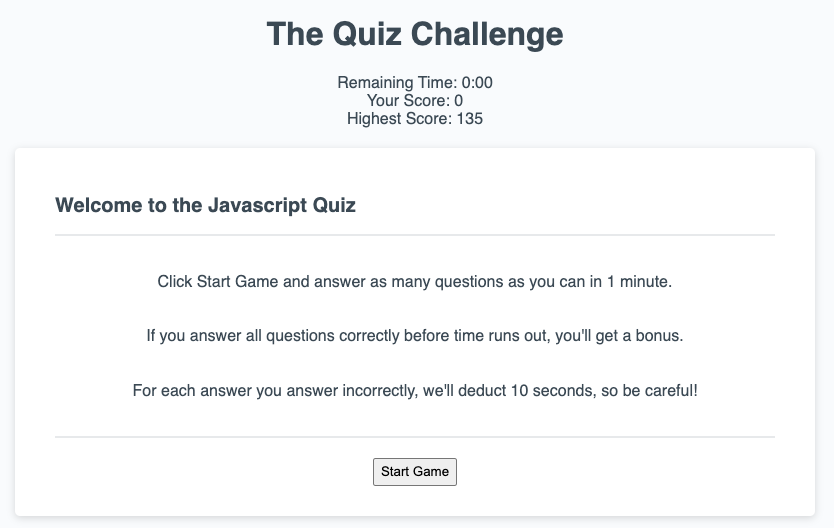
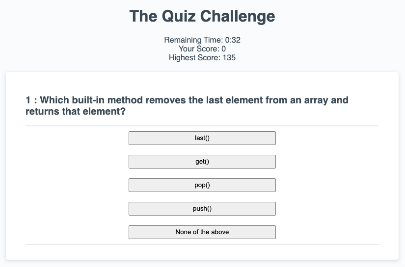
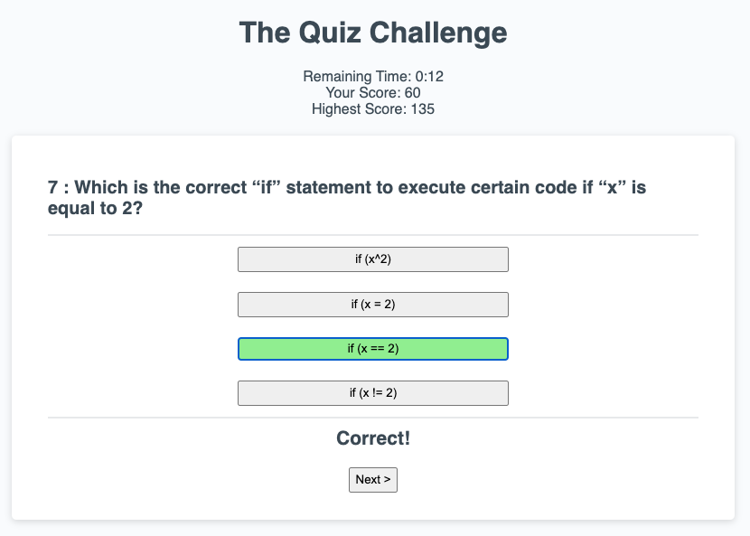
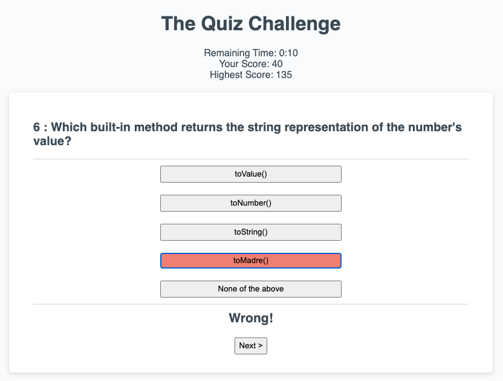
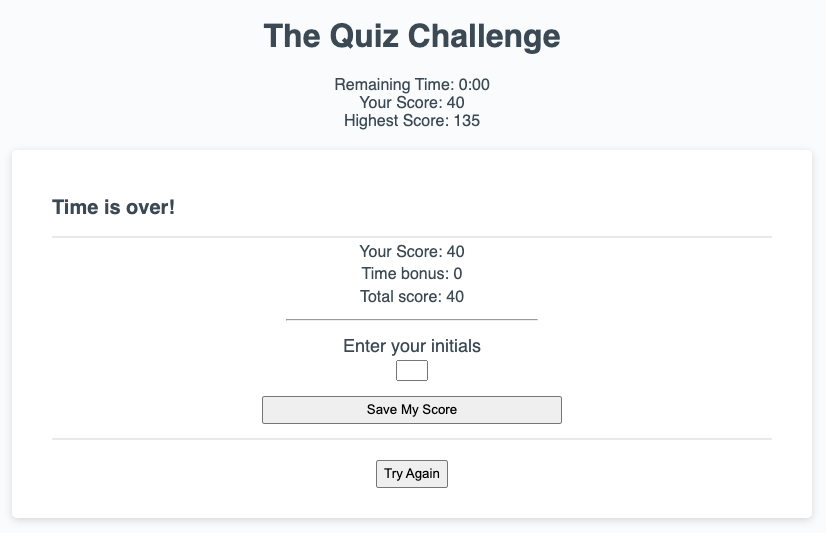
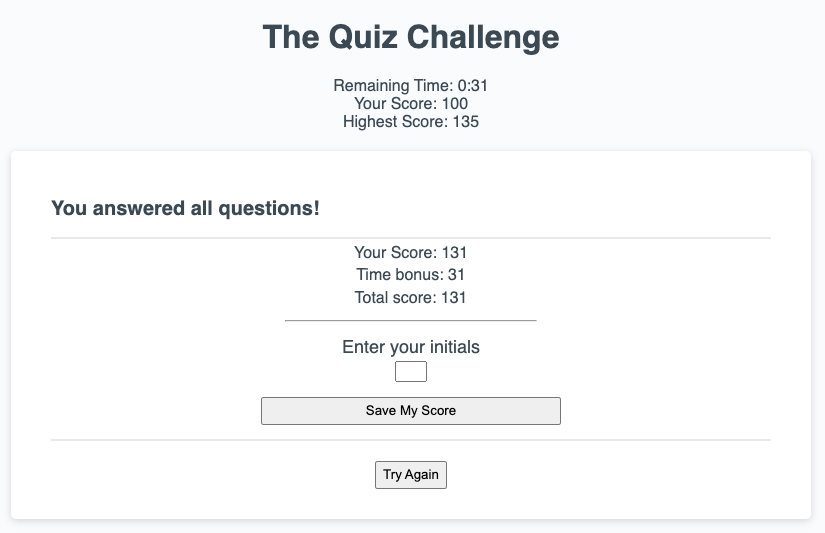
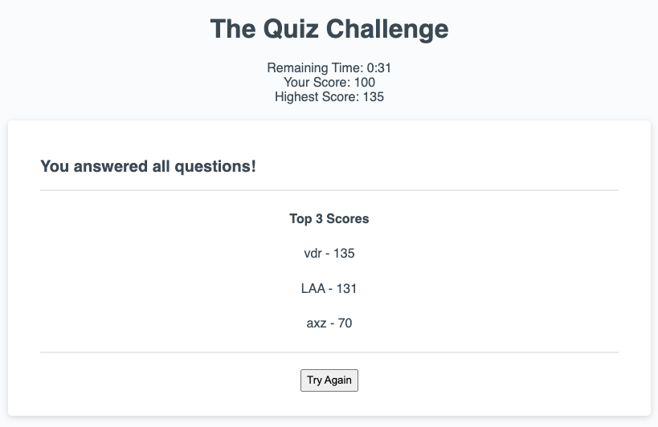

# 04 JavaScript: The Quiz

Application that asks for 10 random questions out of a pool of N questions. Users have to answer correctly as many questions as possible in one minute. 

* For each correct question, users earn 10 points. 
* For each incorrect question users lose 10 seconds. 
* If users answer all questions correctly, they get the remaining seconds as a bonus added to their score.
* When time runs out or all ten questions are answered, the score is displayed.
* Users can enter their initials at the end of the game.
* The top 3 scores are stored in local storage and displayed in the screen.
* The top highscore is retrieved and displayed on every new game.

## Table of contents

* [Initial Setup](#Initial-Setup)
* [Starting the game](#Starting-the-game)
* [Asking random questions out of a pool of questions](#Asking-random-questions-out-of-a-pool-of-questions)
* [Validate the answer and display "Correct" or "Wrong"](#-Validate-the-answer-and-display-"Correct"-or-"Wrong")
* [Ending the game](#Ending-the-game)
* [Storing user initials](#Storing-user-initials)


## Logic
The very first step is to set up our pool of questions. I'm opting to create an array of objects. Each object contains a question, a list of possible answers, the index of the correct answer, and a flag to indicate if this question has been asked:
```
var questions = [
    { // question object
        question:   "Question text",
        answers:    ["Answer 1", "Answer 2", "Answer 3", ... , "Answer n"],
        correctAnswer:  0,
        asked:      False
    }
    ... 
    {  // More question objects}
]
```
In future iterations, this object can hold questions pulled from a database.

### Initial setup
The following variables are needed to keep track of the remaining time, the number of questions asked, the score, and the count of correct answers:

```
var timeLeft = 0;
var questionsLeft = 10;
var score = 0;
var questionCounter = 0;
var correctAnswers = 0;
```
We'll also need to retrieve information from local storage, and use a couple variables to select the span on which we'll update the time, and the button to start the game:
```
var localStorage = window.localStorage;
var timeContainer = document.getElementById('remaining-time');
var startBtn = document.getElementById('start-game');
```
We need to pull the highscores from local storage and, if they exist, we get the highest score and displaye it in the screen:
```
// Get highscores array from local storage
var highScores = localStorage.getItem('highscores') ? 
    JSON.parse(localStorage.getItem('highscores')) : [];
highScores.sort (function (a,b) {
    return b.score - a.score;
});

// Because we sorted the array by score, the first element is the highest
var highScore = highScores[0].score;
var highScoreEl = document.getElementById('highest-score');
highScoreEl.innerHTML = highScore;
```
With this, we have the initial screen set up (the first time users play the game, the highest score will be zero):


### Starting the game
The game starts when users click Start Game. We have to add an event listener to this button:
```
startBtn.onclick = startGame;
```
This listener will start the timer and kick off the _selectNextQuestion()_ method which start going through the questions randomly. Also, when the time runs out it starts the _endGame()_ method to end the game in 'Timeout'.
```
var updateTimeLeft;

// Starts the game and timer
function startGame() {
    timeLeft = 60;
    questionsLeft = 10;
    score = 0;
    questionCounter = 0;
    correctAnswers = 0;
    updateTimeLeft = setInterval(function() {
        timeLeft--;
        var mins = Math.floor(timeLeft / 60);
        var secs = timeLeft % 60;
        timeContainer.textContent = mins + ":" + padLeftZeros(secs);
        if (timeLeft<=0) {
            timeContainer.textContent = "0:00";
            clearInterval(updateTimeLeft); 
            endGame('Timeout');
        }
    },1000);

    startBtn.style.display = "none";
    selectNextQuestion();
};
```
The padLeftZeros function adds a leading left zero to the seconds when it is bewtween 0 and 9, for aesthetic purposes on the timer.
```
// Adds a left zero when seconds are less than 10 - I couldn't find an easier way
var padLeftZeros = function (num) {
    if (num < 10) {
        return "0"+num;
    } else {
        return ""+num;
    }
};
```
### Asking random questions out of a pool of questions
When invoked, users will be presented with a question at random. Because we are not going to go through the array of objects in order, we'll need a counter to know when we hit 10 questions.

```
function selectNextQuestion() {
    // Increase question counter
    questionCounter++;
    ...
```
We'll also clear the controls area inner HTML to remove the Start Game button. We'll use this area to let the user know if their answer was Correct or Wrong. And we'll print a _Next_ button for shoppers to go to the next question.
```
    ...
    // Clear the controls area
    var footer = document.getElementById('controls');
    footer.innerHTML = "";
    ...
```
Now we will select a random question by generating a random number between 0 and the length of the questions array. I'm adding a while cycle to continue picking a number until we select a question that has not been asked.
> Initially all questions will have their _asked_ property equals FALSE. But as we go on asking questions we'll mark the questions as _asked_ = TRUE.
```
    ...
    // Randomly select a number between 0 and the number of questions
    var questionNumber = Math.floor(Math.random()*questions.length);
    
    // Check if we have asked that question before, 
    // if so, get a different number until we get one we haven't asked.
    while (questions[questionNumber].asked) {
        questionNumber = Math.floor(Math.random()*questions.length);
    } 
    // Note: We must always ask (questions.length - 1) questions 
    // otherwise we'll get on an infinite loop on which 
    // all questions are asked!
    
    var currentQuestion = questions[questionNumber];
    ...
```
Now we need to print the question and all the answers on the screen. Each question has a variable number of answers, so we'll do a for cycle from 0 to _currentQuestion.answers.length_.



> As we display each question, we are adding an event listener to _validateAnswer_ to each button.
```
    ...
    // Print the question
    var questionEl = document.getElementById('question');
    questionEl.innerHTML = "<h2>" + questionCounter + 
        " : " + currentQuestion.question +"</h2>"

    var answersEl = document.getElementById('answers');
    answersEl.innerHTML = "";
    // Print the answers as buttons
    for (var i=0; i<currentQuestion.answers.length; i++) {
        var answerButton = document.createElement("button");
        answerButton.setAttribute("answer-id", i); 
        answerButton.setAttribute("question-id", questionNumber);
        answerButton.setAttribute("class","answer-button")
        answerButton.innerText = currentQuestion.answers[i];
        answerButton.addEventListener("click", validateAnswer);
        answersEl.appendChild(answerButton);
    }
    ...
```
After printing the question in the screen, we must mark the _asked_ property of the current question to TRUE. We'll also derease the _questionsLeft_ counter.
> We are asking if _questionsLeft_ is zero before decreasing the _questionsLeft_ counter so that we can ask exactly 10 questions.

If there are no questions left, we end the game with a 'Finished Questions' parameter.
```
    ...
    // Mark this question asked so that we don't ask it again
    questions[questionNumber].asked = true;

    // Reduce the counter of questions left
    if (!questionsLeft) {
        clearInterval(updateTimeLeft); 
        endGame('Finished Questions');
    }
    questionsLeft--;
}
```
### Validate the answer and display "Correct" or "Wrong"
When any answer is clicked, the following function is called. We'll identify which answer was clicked by using the _target_ property of _event_.
```
function validateAnswer (event) {
    var questionNumber = event.target.getAttribute('question-id');
    var answerSelected = event.target.getAttribute('answer-id');
    ...
```
At the same time we pull the question number from the question element we displayed in the screen. With ID we'll compare the answer selected against the _correctAnswer_ property of the question displayed in the screen.
> We are counting +10 points for every correct answer. And discounting -10 seconds for every incorrect answer.
```
    ...
    if (questions[questionNumber].correctAnswer === Number.parseInt(answerSelected)) {
        score+=10;
        correctAnswers++;
        console.log(correctAnswers);
        event.target.setAttribute('class', 'answer-button correct');
        displayMessage("Correct!");
    } else {
        timeLeft-=10;
        event.target.setAttribute('class', 'answer-button incorrect');
        displayMessage("Wrong!");
    }
    ...
```
> The classes 'correct' and 'incorrect' are assigned to colour the button green or red, depending of the answer.




After each answer, we need to update the score in the screen. But we also need to validate that if we've passed the highScore, the new highScore is the current score, and needs to be udpated - and displayed in the screen.
```
    ...
    var scoreEl = document.getElementById('your-score');
    scoreEl.innerHTML = score;

    // If the score is higher than the high score update it in the screen
    if (score > highScore) {
        var highScoreEl = document.getElementById('highest-score');
        highScore = score;
        highScoreEl.innerHTML = highScore;
    }
    ...
```
An important step is: removing the event listener from all the answer buttons after an answer has been selected. This will prevent the users from clicking on many answers.
```
    ...
    // Remove the event listener from all answers so that 
    // users can't validate the same question over and over
    var answers = document.getElementsByClassName('answer-button');
    for (var i=0; i<answers.length; i++) {
        answers[i].removeEventListener('click',validateAnswer);
    }
    
}  
```
The function _displayMessage_ shows a "Correct" or "Wrong" message on the controls area. In addition we add a _Next_ button for the user to go to the next question.
```
function displayMessage(message) {
    var footer = document.getElementById('controls');
    var correctMessage = document.createElement ("h3");
    correctMessage.innerHTML = message;
    var nextQuestionButton = document.createElement ("button");
    nextQuestionButton.addEventListener("click", selectNextQuestion);
    nextQuestionButton.innerHTML = "Next >"
    footer.appendChild(correctMessage);
    footer.appendChild(nextQuestionButton);
}
```
### Ending the game
The game can end due to two reasons: when the time runs out 'timeout' or when the user has finished all 10 questions. The following function is called when any of those events occur.

> On the timer function, if time runs out


```
    ...
    if (timeLeft<=0) {
        timeContainer.textContent = "0:00";
        // We top the timer to prevent the timeLeft var go into negative
        clearInterval(updateTimeLeft); 
        endGame('Timeout');
    }
    ...
```
> On the selectNextQuestion function, when the questionsLeft counter reaches zero


```
    if (!questionsLeft) {
        clearInterval(updateTimeLeft); 
        endGame('Finished Questions');
    }
```
On the _endGame_ function, we'll receive the game ending reason as a parameter. We'll also add a special bonus if the user answered all questions correctly.

```
function endGame(reason){
    
    // If the user answered correctly all questions, 
    // add time left to score as a bonus to create a grand total 
    var bonus = 0;
    if (correctAnswers === 10) {
        bonus = timeLeft;
        score += bonus;
    }
```
If the grand total is higher than the high score, we need to udpate this in the screen.
```
    ...
    // If the grand total is higher than the high score, then update screen
    if (score > highScore) {
        var highScoreEl = document.getElementById('highest-score');
        highScoreEl.innerHTML = score;
    }
    ...
```
The end game message will vary if the ending reason is due to timeout or finishing all questions.
``` 
    ...
    // Set header message
    var endGameMessage = reason === 'Timeout'? 
        'Time is over!' : 'You answered all questions!';
    var questionSection = document.getElementById('question');
    questionSection.innerHTML = ""; // Clear any questions that may be in here;
    ...
```
The score is displayed in the screen along with controls to save the user score.
```
    var titleHeader = document.createElement("h2");
    titleHeader.innerHTML = endGameMessage;
    questionSection.appendChild(titleHeader);
   
    // Set score on the answers area and allow user to enter their initials
    var answersSection = document.getElementById('answers');
    answersSection.innerHTML = "<p>Your Score: "+ score+"</p>" +
        "<p>Time bonus: " + bonus + "</p>" +
        "<p>Total score: " + score + "</p><hr>"+
        "<label>Enter your initials</label>";

    var initialsBox = document.createElement("input");
    initialsBox.setAttribute('maxlength','3');
    initialsBox.setAttribute('id','initials-box');

    var saveInitialsButton = document.createElement("button");
    saveInitialsButton.innerText = "Save My Score";
    saveInitialsButton.addEventListener('click',recordHighscore);

    answersSection.appendChild(initialsBox);
    answersSection.appendChild(saveInitialsButton);
    
    // Clear the controls area and add a "Try Again" button
    var footer = document.getElementById('controls');
    footer.innerHTML = "";

    var tryAgainButton = document.createElement('button');
    tryAgainButton.innerHTML = "Try Again";
    tryAgainButton.addEventListener('click',refreshPage);

    footer.appendChild(tryAgainButton);

}
```
> The Save My Score button will have an event listener to call the _recordHighscore_ function, which will store the score in localStorage. 

> The Try Again button needs an event listener to refresh the page is clicked.
### Storing user initials
The _recordHighscore_ function is very straightforward. If the user entered their initials, we proceed to store them, if not, we show a message prompting the user to enter them.
```
function recordHighscore(event) {
    var initialsBox = event.target.previousElementSibling;
    if (initialsBox.value!='') { 
       ... code to save score...
    } else {
        alert('Please enter your initials');
    }
}
```
The code to save score is as follows: First, we push the _currentScore_ into the _highScores_ array. 
```
    ...
        var currentScore = {
            initials: initialsBox.value,
            score: score
        }
        // Add score to high scores
        highScores.push (currentScore);
    ...
```
Next, we shall sort the _highScores_ array, and slice the array to only keep the first three items. Because we only want to display the top three high scores.
```
    ...
        // Reorder high scores from highest to lowest
        highScores.sort (function (a,b) {
            return b.score - a.score;
        });
        // Keep only the top 3 elements
        highScores = highScores.slice(0,3)
        // Record high scores in local storage
        localStorage.setItem('highscores', JSON.stringify(highScores));

        // Display high scores
        showHighscores();
    ...
```

### Displaying top three high scores
The last step is to simply display all top three high scores in the _answers_ area. This is a very straight-forward function: We run through the highScores and create &lt;p&gt; elements to display the scores in the screen.

```
function showHighscores() {
    var answersSection = document.getElementById('answers');
    answersSection.innerHTML = "<p><strong>Top 3 Scores</strong></p>";
    
    for (var i=0; i<highScores.length; i++) {
        var highScoreEl = document.createElement('p');
        highScoreEl.innerHTML = highScores[i].initials + " - " + highScores[i].score;
        answersSection.appendChild(highScoreEl);
    }
    
}
```

### Playing again
The Try Again button has an event listener that simply reloads the page. Since we have stored the high scores in the local storage, the easisest way to reset the game is to simply restart.

